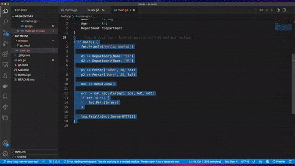

# Go MemUI

> 👨🏼‍💻 Work in progress

*go-memu* - is in-memory object storage which can generate an automated JSON API for added values.

📚 It is an experimental Open Source Go package for learning purposes.

## ℹ️ Learning Materials

The whole development process is available as a step-by-step tutorial series. You can check the video course here:

#### [⚓️ Building Go-MemUI Project](https://bit.ly/go-memui)

## 📜 How to use?



#### How to install?

Use go get to install the latest version of the package:

```sh
go get github.com/kenanbek/go-memui
```

Then, import `go-memui` in your project:

```go
import "github.com/KenanBek/go-memui"
```

Please note that when using `go-memui` in the source code, Go will drop the `go-` part and let you use only `memui`. See the example below.

#### Example:

```go
package main

import (
	"fmt"
	"log"

	"github.com/KenanBek/go-memui"
)

...

func main() {
	fmt.Println("Hello, World!")

	d1 := Department{Name: "IT"}
	d2 := Department{Name: "HR"}

	p1 := Person{"John", 30, &d1}
	p2 := Person{"Mary", 25, &d2}

	mui := memui.New()

	err := mui.Register(&p1, &p2, &d1, &d2)
	if err != nil {
		fmt.Println(err)
	}

	log.Fatalln(mui.ServerHTTP())
}
```

See the `testapp` folder for detailed examples.
